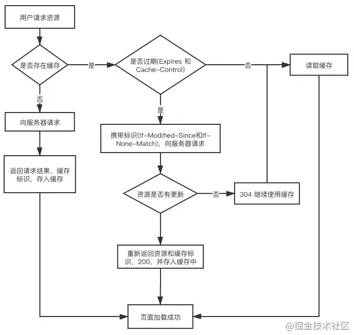

# 基础复习

## 一、Javascript 基础

### DOM 常用 API

```javascript
// 获取元素
const oDiv = document.getElementById('idName')

// 新建元素
const oDiv2 = document.createElement('div') // 标签名
oDiv2.innnerHTML = 'div2'

// 插入元素
oDiv.appendChild(oDiv2)

// 删除元素
oDiv.removeChild(oDiv2)
```

### null 和 undefined 的区别

`null`:

1. `Number(null)`得到 0
2. 作为函数的参数，表示该函数的参数不是对象
3. 作为对象原型链的重点

`undefined`:

1. `Number(undefined)`得到`NaN`
2. 变量被声明但没有赋值就等于`undefined`
3. 调用函数时，对应的参数没有提供，也是`undefined`
4. 对象没有赋值，这个属性的值为`undefined`
5. 函数没有返回值，默认返回`undefined`

### 事件流

事件流分为三个阶段：1、事件捕获，2、目标，3、事件冒泡

###### addEventListener

语法: `target.addEventListener(type, handler, options/useCapture)`

1. `type`: 表示监听事件类型的字符串
2. `handler`: 处理的事件

?> addEventListener 的第三个参数涉及到冒泡和捕获，为 true 时是捕获，为 false（默认值）时是冒泡

?> 第三个参数是一个对象{passive:true}，针对的是 Safari 浏览器，禁止/开启使用滚动的时候要用到

###### 阻止冒泡 event.stopPropagation()

```javascript
document.querySelector('#li').addEventListener('click', () => {
  console.log('li')
})
const btn = document.querySelector('#btn')
btn.addEventListener('click', () => {
  console.log('button')
  event.stopPropagation() // li就不会显示
})
```

###### onmouseover 和 onmouseenter 区别

前者发生移动就会触发，例如在节点的子节点发生移动也会触发；而后者只有在第一次进入会触发

### 实现 sleep

```javascript
async function sleep(time) {
  return new Promise((resolve) => {
    setTimeout(resolve, time)
  })
}

async function foo() {
  await sleep(2000)
  console.log(123)
}

foo()
```

### 函数式编程

函数式编程是一种编程范式，把计算看作是对数学函数的评估，避免了状态的变化和数据的可变

1. 纯函数

如果给定相同的参数，则返回相同的结果（不依赖外部的状态）；它不会引起任何副作用（不修改全部变量和传参）。

例如：

```javascript
// 计算圆面积
const calculateArea = (r) => r * r * PI
const calculateArea2 = (r, pi) => r * r * pi
```

第一个不是纯函数，因为会依赖外部的变量 PI，而第二个是

```javascript
const add(value) {
  return value + 1
}
```

以上函数也是纯函数

**纯函数的好处**  
容易测试，不依赖任何外部变量，同时也不污染外部的变量

```javascript
const values = [1, 2, 3, 4, 5]

let sumOfValues = 0

// 会修改sumOfValues和i的值
function sum1() {
  for (let i = 0; i < values.length; i++) {
    sumOfValues += values[i]
  }
}

// 使用递归
function sum(list, accumulator) {
  if (list.length == 0) {
    return accumulator
  }

  return sum(list.slice(1), accumulator + list[0])
}

console.log(sum(values, sumOfValues))
```

### PWA

PWA(Progressive Web Apps，渐进式 Web 应用)，将 Web 网页服务打包提供类似原生安装应用对的使用体验；跟微信小程序很像，但与微信小程序的区别是，微信小程序的使用前提是安装微信，而 PWA 不需要，大部分浏览器已经可以支持 PWA 应用

### 数组去重

```javascript
const oldArr = [1, 1, 2, 2, 3, 3]
// 第一种方法
const newArr = []
for (let i = 0; i < oldArr.length; i++) {
  if (!newArr.includes(oldArr[i])) {
    newArr.push(oldArr[i])
  }
}

// set
const newArr = [...new Set(oldArr)]

// filter
const newArr = oldArr.filter(
  (item, index) => oldArr.lastIndexOf(item) === index
)
```

### 数字化金额

```javascript
// 方法一
console.log(Number(num).toLocaleString('en-us'))
```

### 遍历数组空值

1. `forEach()`、`filter()`、`reduce()`、`every()` 和 `some()` 都会跳过空位。
2. `map()` 会跳过空位，但会保留这个值
3. `join()` 和 `toString()` 会将空位视为 `undefined`，而 `undefined` 和 `null` 会被处理成空字符串

### let 与 var

```javascript
for (var i = 0; i < 5; i++) {
  setTimeout(() => {
    console.log(i)
  }, 1000)
} // 55555

for (let i = 0; i < 5; i++) {
  setTimeout(() => {
    console.log(i)
  }, 1000)
} // 01234
```

以上区别在于 var 会造成全局污染，而 setTimeout 又说宏任务，等到 script 执行完后，收集到 i 是 5；而使用 let，会再 for{}形成作用域

### 暂时性死区

```javascript
let a = 1
let test = function () {
  console.log(a)
  a++
}

test()

let b = 1
let test2 = function () {
  console.log(b)
  let b = 2
  b++
}

test2() // Error
```

第二个方法报错的原因是 `let` 没有变量提升，所以在{}中出现了暂时性死区

```javascript
console.log(a)

var a = 1 // var 有变量提升，但提前使用会是 undefined
```

## 二、闭包与柯里化

柯里化（Currying）是把接受多个参数的函数变换成接受一个单一参数(最初函数的第一个参数)的函数，并且返回接受余下的参数且返回结果的新函数的技术。  
核心思想是把多参数传入的函数拆成单参数函数，内部再返回调用下一个函数，依次处理剩余的参数

好处是：

1. 参数复用
2. 提前返回
3. 延迟计算/运行

### 通用的实现

```javascript
function currying(fn, ...rest1) {
  return function
}
```

## 从浏览器输入 url 到请求返回发生了什么

### 一、输入网址并解析

如果输入的不是 URL 结构的字符串，浏览器会使用默认的搜索引擎搜索该字符串

###### URL 的组成

URL 主要由`协议`、`主机`、`端口`、`路径`、`搜索字段`、`锚点`组成

#### 解析 URL

输入 URL 后，浏览器会解析出协议、主机、端口、路径等信息，并构造一个 HTTP 请求

1. 浏览器发送请求前，根据请求头的 expires 和 cache-control 判断是否命中（包括是否过期）强缓存策略，如果命中，直接从缓存获取资源，不会发送请求。如果没有命中，则进入下一步；
2. 没有命中强缓存规则，浏览器会发送请求，根据请求头的 If-Modified—Since 和 If-None-Match 判断是否命中协商缓存，如果命中，直接从缓存获取资源，如果没有命中，则进入下一步
3. 如果前两步都没有命中，则直接从服务端获取资源

#### 浏览器缓存

##### 强缓存

强缓存就是向浏览器查找该请求结果，并根据该结果的缓存规则来决定是否使用该缓存结果的过程。分为 Expires 和 Cache-Control



`Expires`

- 版本 HTTP 1.0
- 语法：Expires: Wed, 22 Nov 2019 08:41:00 GMT

`Cache-Control`

- 版本 HTTP 1.1
- 语法：Cache-Control:max-age=3600

```javascript
// server.js
const http = require('http')
const fs = require('fs')

http
  .createServer(function (request, response) {
    console.log('request', request.url)

    if (request.url === '/') {
      const html = fs.readFileSync('./index.html', 'utf-8')
      response.writeHead(200, {
        'Content-Type': 'text/html',
      })
      response.end(html)
    }

    if (request.url === '/script.js') {
      response.writeHead(200, {
        'Content-Type': 'text/javascript',
        'Cache-Control': 'max-age=5,public', // 缓存5s
      })
      response.end('console.log("script loaded")')
    }
  })
  .listen(8888)

console.log('server listening on 8888')
```

##### 协商缓存

协商缓存就是强缓存失效后，浏览器携带缓存标识向服务器发起请求，由服务器根据缓存标识决定是否使用缓存的过程


##### DNS 域名解析

### TCP/IP 连接：三次握手

#### 三次握手

客户端和服务端在进行 http 请求和返回的工程中，需要创建一个 TCP connection（由客户端发起），http 不参在连接这个概念，它只有请求和响应，请求和响应都是数据包，它们之间的传输通道就是 TCP connection


第一次握手：主机 A 发送位码为 SYN=1，随机产生 Seq number=1234567 的数据包到服务器，主机 B 由 SYN=1 知道，A 要求建立联机（第一次握手，由浏览器发起，告诉服务器我要发送请求了）

第二次握手：主机 B 收到请求后确认联机信息，向 A 发送 ACK number=（A 中的 Seq+1），SUN=1，ACK=1234567+1，随机产生 Seq=7654321 的包（第二次握手，由服务器发起，告诉浏览器我准备接收了，你赶紧发送）

第三次握手：zhujiA 收到后检测 ACK number 是否正确（与第一个发送的 sqp number+1），以及位码 SYN 是否为 1，若正确，主机 A 会再发送 ack number = （主机 B seq + 1），ack = 7654321 + 1，主机 B 收到后确认 Seq 与 Ack = 7654321 则连接建立成功（第三次握手，由浏览器发送，告诉服务器，我马上就发）

?>总是要问：为什么需要三次握手，两次不行吗？其实这是由 TCP 的自身特点可靠传输决定的。客户端和服务端要进行可靠传输，那么就需要确认双方的接收和发送能力。第一次握手可以确认客服端的发送能力,第二次握手，服务端 SYN=1,Seq=Y 就确认了发送能力,ACK=X+1 就确认了接收能力,所以第三次握手才可以确认客户端的接收能力。不然容易出现丢包的现象。

##### 半链接状态

服务器第一次收到客户端的 SYN 之后，就会处于 SYN_RCVD 状态，此时双方还没有完全建立其连接，服务器会把此种状态下请求连接放在一个队列里，我们把这种队列称之为半连接队列。

##### 三次握手过程中可以携带数据吗？

其实第三次握手的时候，是可以携带数据的。但是，第一次、第二次握手不可以携带数据。
为什么这样呢?大家可以想一个问题，假如第一次握手可以携带数据的话，如果有人要恶意攻击服务器，那他每次都在第一次握手中的 SYN 报文中放入大量的数据。因为攻击者根本就不理服务器的接收、发送能力是否正常，然后疯狂着重复发 SYN 报文的话，这会让服务器花费很多时间、内存空间来接收这些报文。
也就是说，第一次握手不可以放数据，其中一个简单的原因就是会让服务器更加容易受到攻击了。而对于第三次的话，此时客户端已经处于 ESTABLISHED 状态。对于客户端来说，他已经建立起连接了，并且也已经知道服务器的接收、发送能力是正常的了，所以能携带数据也没啥毛病。

## CSS

### 盒模型

css3 中的盒模型有：标准盒模型、IE 盒模型

两种盒模型都是由 content+padding+border+margin 构成，其中大小是由 content+padding+border 决定的

1. 标准盒模型：只包含 content
2. IE 盒模型：content+padding+border

可以通过 box-sizing 来改变元素的盒模型

- box-sizing:content 标准盒模型
- box-sizing:border-box IE 盒模型

### css 选择器和优先级

!important > style > id > class

### 重排和重绘的理解

- 重排：无论通过什么方式影响了元素的几何信息（元素在视口内的位置和尺寸大小），浏览器需要重新计算元素在视口内的

### 对 BFC 的理解

BFC 称为块级格式化上下文  
W3C 的解释式：它决定了元素如果对其内容进行定位，以及与其他元素的关系和相互作用，当涉及到可视化布局时，BFC 提供了一个环境，HTML 在这个环境中按照一定的规则进行布局  
简单来说就是，BFC 是一个完全独立的空间（布局环境），让空间里的子元素不会影响到外面的布局，可以将 BRC 看成是 CSS 元素属性

#### 怎么触发

- overflow：hidden
- display: inline-block
- postion: absolute
- postion: fixed
- display: table-cell
- display: flex

### 实现两栏布局（左侧固定，右侧自适应）

1. 左侧左浮动 float: left，右侧 margin-left： xxxpx
2. 左侧左浮动，右侧加 BFC 包裹
3. flex 布局
4. 左边绝对定位，右边 margin-left

### 圣杯布局和双飞翼布局

目的：

- 三栏布局，中间一栏最先加载和渲染
- 两侧内容固定，中间内容随宽度自适应
- 一般用于 pc 网页

技术总结：

- 使用 float
- 两侧使用 margin 负值

###### 圣杯布局

```html
<!DOCTYPE html>
<html>
  <head>
    <meta charset="utf-8" />
  </head>
  <style>
    html,
    body {
      padding: 0;
      margin: 0;
    }
    .container {
      padding-left: 200px;
      padding-right: 150px;
    }
    .column {
      float: left;
    }
    .container::after {
      content: '';
      clear: both;
    }
    .left {
      background-color: aquamarine;
      width: 200px;
      margin-left: -100%;
      position: relative;
      right: 200px;
    }
    .right {
      background-color: beige;
      width: 150px;
      margin-right: -150px;
    }
    .center {
      background-color: blanchedalmond;
      width: 100%;
    }
  </style>
  <body>
    <div class="container">
      <div class="center column">center</div>
      <div class="left column">left</div>
      <div class="right column">right</div>
    </div>
  </body>
</html>
```

###### 双飞翼布局

```html
<!DOCTYPE html>
<html>
  <head>
    <meta charset="utf-8" />
    <style>
      html,
      body {
        padding: 0;
        margin: 0;
      }
      body {
        min-width: 500px;
      }
      .container {
        width: 100%;
      }
      .column {
        float: left;
      }
      .center {
        background-color: aliceblue;
        margin-left: 200px;
        margin-right: 150px;
      }
      .left {
        background-color: antiquewhite;
        width: 200px;
        margin-left: -100%;
      }
      .right {
        width: 150px;
        background-color: aquamarine;
        margin-left: -150px;
      }
      .footer {
        clear: both;
      }
      .footer,
      .header {
        background-color: black;
        color: wheat;
      }
    </style>
  </head>
  <body>
    <div class="header">header</div>
    <div class="container column">
      <div class="center">center</div>
    </div>
    <div class="left column">left</div>
    <div class="right column">right</div>
    <div class="footer">footer</div>
  </body>
</html>
```

### flex

[阮一峰 flex 教程](https://www.ruanyifeng.com/blog/2015/07/flex-grammar.html)

## JS

### 判断类型

1. 判断基本类型 typeof ，唯一的问题是无法辨别出 object 和 null
2. instanceof 可以判断对象类型，不能判断基本数据类型
3. Object.prototype.toString.call()

```javascript
Object.prototype.toString.call(2) // "[object Number]"
Object.prototype.toString.call('') // "[object String]"
Object.prototype.toString.call(true) // "[object Boolean]"
Object.prototype.toString.call(undefined) // "[object Undefined]"
Object.prototype.toString.call(null) // "[object Null]"
Object.prototype.toString.call(Math) // "[object Math]"
Object.prototype.toString.call({}) // "[object Object]"
Object.prototype.toString.call([]) // "[object Array]"
Object.prototype.toString.call(function () {}) // "[object Function]"
```

判断数组：

1. Array.isArray()
2. typeof func
3. Object.prototype.toString.call()

### 深拷贝

#### 浅拷贝和深拷贝的区别

浅拷贝：创建一个新对象，这个对象有着原始对象属性值的一份精确拷贝。如果属性是基本类型，拷贝的就是基本类型的值，如果属性是对象，拷贝的就是内存地址  
深拷贝：将一个对象从内存中完整的拷贝一份出来，从堆内存中开辟一个新的区域存放新对象，且修改对象不会影响源对象

#### 最简单的版本

```javascript
JSON.parsse(JSON.stringify(obj))
```

#### 基础版

```javascript
function clone(target, map = new Map()) {
  // 递归
  if (typeof target === 'object') {
    // 判断数组还是对象
    let cloneTarget = Array.isArray(target) ? [] : {}

    // 解决循环引用的问题
    if (map.get(target)) {
      return map.get(target)
    }
    map.set(target, cloneTarget)

    for (let key in target) {
      // 是自己实例上的属性再复制
      if (target.hasOwnProperty(key)) {
        cloneTarget[key] = clone(target[key], map)
      }
    }
    return cloneTarget
  } else {
    return target
  }
}
```

### call,apply,bind 的实现

#### call

```javascript
Function.prototype.myCall = function (ctx) {
  // 判断调用对象一定要是函数
  if (typeof this !== 'function') {
    throw new TypeError('Type Error')
  }
  // 取出除对象外的所有参数
  let args = [...arguments].slice(1)
  let result = null
  // 如果没有传调用对象，就默认全局
  ctx = ctx || global
  // 将方法加到调用对象上
  ctx.fn = this
  // 调用方法获取结果
  result = ctx.fn(...args)
  // 删除调用的属性方法
  delete ctx.fn
  // 返回结果
  return result
}
```

#### apply

```javascript
Function.prototype.myApply = function (ctx) {
  if (typeof this !== 'function') {
    throw new TypeError('Type Error')
  }
  let result = null
  ctx = ctx || global
  // 使用Symbol保证属性的唯一，不会污染原来的属性
  let fnSymbol = Symbol()
  ctx[fnSymbol] = this
  // 执行方法
  // 判断有没有传入数组参数
  if (arguments[1]) {
    result = ctx[fnSymbol](...arguments[1])
  } else {
    result = ctx[fnSymbol]()
  }
  delete ctx[fnSymbol]
  return result
}
```
