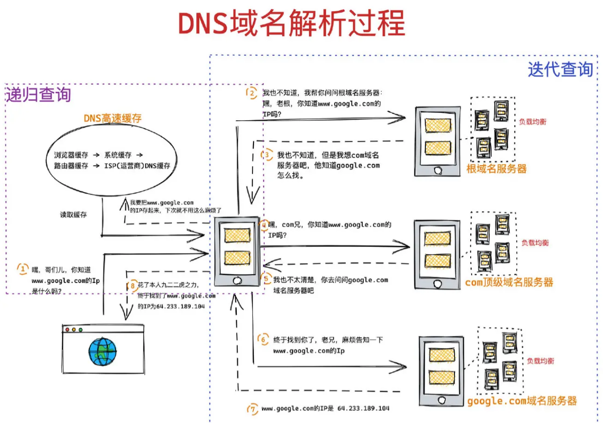

# 前端面试八股文

## HTML

### HTML 语义化

1. 提高代码可读性
2. 有利于 SEO（搜索引擎）
3. 很好的呈现页面内结构

### HTML5 新增语义化标签

1. `<header></header>` 定义文档头部区域
2. `<footer></footer>` 定义文档尾部区域
3. `<article></article>` 定义页面独立内容区域
4. `<aside></aside>` 定义侧边栏内容
5. `<nav></nav>` 定义导航部分
6. `<section></section>` 定义文档中的节

### script 标签 defer 和 async 的区别

- 没有任何其他属性：当 `HTML` 解析到`<script>`标签时，会停止解析，先下载 `js` 脚本，并执行完后再继续解析
- `async`：当 `HTML` 解析到时，会下载 `js` 脚本，但不停止解析，等脚本下完，停止解析 `HTML，执行脚本，执行完后再解析。有可能还没下载完就解析好了，所以不一定会阻塞` `HTML` 解析。
- `defer`：当 `HTML` 解析到`<script>`，会下载 `js` 脚本，等 `HTML` 标签完全解析完后，再执行脚本

现在常用的做法是：

1. 如果 `script` 放到 `head` 就使用 `defer`
2. 直接放到 `body` 的最后

### 浏览器缓存

浏览器缓存分为**强缓存**和**协商缓存**

#### 强缓存

强制缓存就是向浏览器缓存查找该请求结果，并根据该结果的缓存规则来决定是否使用该缓存结果的过程。分为`Expires`(HTTP 1.0)和`Cache-Control`(HTTP 1.1)

#### 协商缓存

在强制缓存失效后，浏览器携带缓存标识向服务器发起请求，由服务器根据缓存标识决定是否使用缓存的过程，主要有`Last-Modified`和`ETag`(HTTP 1.1)

### DNS 域名解析



#### 递归查询

我们的浏览器、操作系统、路由器都会缓存一些 URL 对应的 IP 地址，统称为 DNS 高速缓存

#### 迭代查询

局部的 DNS 服务器并不会自己向其他服务器进行查询，而是把能够解析该域名的服务器 IP 地址返回给客户端，客户端会不断的向这些服务器进行查询，直到查询到位置，迭代只会帮你找到相关的服务器

#### DNS 负载均衡

当一个网站有多个服务器地址时，在应答 DNS 查询的时候，DNS 服务器会对每个查询返回不同的解析结果，也就是返回不同的 ip 地址，从而把访问引导到不同的服务器上去

### 三次握手

#### 第三次握手的重要性

因为客户端和服务端要进行可靠传输，就需要确认双方的**接收**和**发送**能力

- 第一次握手确定了客户端的发送能力
- 第二次握手， ack=X+1 确定了服务器的接收能力，seq=Y 确定了发送能力
- 第三次握手确定客户端的接收能力

#### 三次握手可以携带数据吗

第三次可以携带，如果第一次携带的话，容易对服务器造成攻击

### 浏览器输入 url 后

1. DNS 解析：将域名转为 IP 地址
2. TCP 链接：TCP 三次握手
3. 发送 http 请求
4. 服务器接收请求并返回 HTTP 报文
5. 浏览器解析并渲染
6. 断开链接：TCP 四次挥手

### 浏览器解析

1. HTML 解析，生成 DOM 树
2. CSS 解析，生成 CSS 规则树
3. 合并 DOM 树和 CSS 规则树，生成 render 树（渲染树）
4. 布局 render 树，算出每一个渲染对象的位置和尺寸
5. 绘制 render 树，系统遍历呈现树，调用`paint`方法，将内容显示到屏幕上

## CSS

### 回流和重绘

- 回流：Layout，也称 Reflow，一般元素的内容、结构、位置或者尺寸发生了改变，需要重新计算样式和渲染树
- 重绘：Repaint，元素发生的改变只影响元素一些外观（例如各种颜色），此时子需要应用新样式绘制这个元素就可以了

?> 回流一定会引起重绘，重绘不一定会引起回流

#### 减少回流

**css**

1. 减少 table 布局
2. 尽可能在 DOM 树最末端改变 class
3. 避免设置多层内联样式
4. 将动画效果应用到 positin 属性为 absolute 或 fixed 上
5. 避免使用 css 表达式（例如 calc()）

**js**

1. 避免频繁操作样式
2. 可以先将元素设为 display：none，操作结束后再显示出来
3. 对于复杂动画使用绝对定位`absolute`或`fixed`

### 盒模型介绍

CSS3 中的盒模型由两种：**标准盒模型**、**IE 盒模型**

盒模型都是由`content+padding+border+margin`构成，其大小都是由`content+padding+border`决定，但盒子内容宽/高度的计算不同

- 标准盒模型： content
- IE 盒模型：content+padding+border

可以通过 box-sizing 来改变元素的盒模型

- box-sizing: content-box 标准盒模型
- box-sizing：border-box IE 盒模型

### 伪类和伪元素

###### 区别

1. 伪类用于当已有元素处于的某个状态时，为其添加对应的样式，这个状态是根据用户行为而动态变化的。(:hover)
2. 伪元素用于创建一些不在文档树中的元素，并为其添加样式。(::before)

?> 为了区分伪类和伪元素，css3 开始伪元素都使用"::"

### CSS 选择器和优先级

一般优先级：
?> `内联`>`ID 选择器`>`类选择器`>`标签选择器`

选择器优先级计算规则  
由 `A`、`B`、`C`、`D` 的值来决定，计算规则如下

1. 如果存在`内联样式`，那么 A=1，否则 A=0
2. B 的值等于` ID 选择器`出现的次数
3. C 的值等于`类选择器`和`属性选择器`和`伪类`出现的总次数
4. D 的值等于`标签选择器`和`伪元素`出现的总次数

!> `!important`可以改变内联，内联加`!important`天下无敌

### BFC 块格式化上下文

`BFC`就是一个完全独立的空间（布局环境），让空间里的子元素不会影响到外面的布局

**常见的触发 BFC**

- overflow:hidden
- display:inline-block
- position:absolute
- position:fixed
- display:table-cell
- display:flex

BFC 具有一些特性：

1. 块级元素会在垂直方向一个接一个的排列，和文档流的排列方式一致。
2. 在 BFC 中上下相邻的两个容器的 margin  会重叠，创建新的 BFC 可以避免外边距重叠。
3. 计算 BFC 的高度时，需要计算浮动元素的高度。
4. BFC 区域不会与浮动的容器发生重叠。
5. BFC 是独立的容器，容器内部元素不会影响外部元素。
6. 每个元素的左 margin  值和容器的左 border  相接触。

利用这些特性，我们可以解决以下问题：

利用 4  和 6 ，我们可以实现三栏（或两栏）自适应布局。
利用 2 ，我们可以避免 margin  重叠问题。
利用 3 ，我们可以避免高度塌陷。

### 两栏布局

左侧固定+右侧自适应布局

1. 左侧 float：left，右侧 margin-left：左侧的宽度
2. 左侧 float：left，右侧 overflow：auto （BFC）
3. 父元素 display：flex，右侧 flex：1
4. 左侧 position：absolute，右侧 margin-left：左侧宽度

### 水平垂直居中

```html
<div class="div"></div>
```

###### absolute + 四边为 0 (定宽高)

```css
.div {
  position: absolute;
  top: 0;
  left: 0;
  right: 0;
  bottom: 0;
  margin: auto;
}
```

###### absolute + margin 负 50% （定宽高）

```css
.div {
  position: absolute;
  top: 50%;
  left: 50%;
  width: 200px;
  height: 200px;
  margin-top: -100px;
  margin-left: -100px;
}
```

###### absolute + transform（不定宽高）

```css
.div {
  position: absolute;
  top: 50%;
  left: 50%;
  transform: translate(-50%, -50%);
}
```

###### flex

```css
.div {
  display: flex;
  justify-content: center;
  align-items: center;
}
```

### position 定位

###### static 静态定位

默认值，left、top、right、bottom 不起作用

###### relative 相对定位

相对于自己元素自己原本的位置进行定位

###### absolute 绝对定位

相对于上一个有定位的父元素（position 不为 static）进行定位

###### fixed 固定定位

相对于视口进行定位

###### 画布和视口

1. 画布：整个页面的大小
2. 视口：浏览器可视范围大小
3. 一般画布大于视口

###### sticky 粘性定位

元素一开始行为像 relative，当位置到达设定好的值（left、top、bottom、right）后，就变成 fixed 定位

## 一、Javascript 基础

### DOM 常用 API

```javascript
// 获取元素
const oDiv = document.getElementById('idName')

// 新建元素
const oDiv2 = document.createElement('div') // 标签名
oDiv2.innnerHTML = 'div2'

// 插入元素
oDiv.appendChild(oDiv2)

// 删除元素
oDiv.removeChild(oDiv2)
```

### null 和 undefined 的区别

`null`:

1. `Number(null)`得到 0
2. 作为函数的参数，表示该函数的参数不是对象
3. 作为对象原型链的起点

`undefined`:

1. `Number(undefined)`得到`NaN`
2. 变量被声明但没有赋值就等于`undefined`
3. 调用函数时，对应的参数没有提供，也是`undefined`
4. 对象没有赋值，这个属性的值为`undefined`
5. 函数没有返回值，默认返回`undefined`

### 事件流

事件流分为三个阶段：1、事件捕获，2、目标，3、事件冒泡

###### addEventListener

语法: `target.addEventListener(type, handler, options/useCapture)`

1. `type`: 表示监听事件类型的字符串
2. `handler`: 处理的事件

?> addEventListener 的第三个参数涉及到冒泡和捕获，为 true 时是捕获，为 false（默认值）时是冒泡

?> 第三个参数是一个对象{passive:true}，针对的是 Safari 浏览器，禁止/开启使用滚动的时候要用到

###### 阻止冒泡 event.stopPropagation()

```javascript
document.querySelector('#li').addEventListener('click', () => {
  console.log('li')
})
const btn = document.querySelector('#btn')
btn.addEventListener('click', () => {
  console.log('button')
  event.stopPropagation() // li就不会显示
})
```

###### onmouseover 和 onmouseenter 区别

前者发生移动就会触发，例如在节点的子节点发生移动也会触发；而后者只有在第一次进入会触发

### 实现 sleep

```javascript
async function sleep(time) {
  return new Promise((resolve) => {
    setTimeout(resolve, time)
  })
}

async function foo() {
  await sleep(2000)
  console.log(123)
}

foo()
```

### 函数式编程

函数式编程是一种编程范式，把计算看作是对数学函数的评估，避免了状态的变化和数据的可变

1. 纯函数

如果给定相同的参数，则返回相同的结果（不依赖外部的状态）；它不会引起任何副作用（不修改全部变量和传参）。

例如：

```javascript
// 计算圆面积
const calculateArea = (r) => r * r * PI
const calculateArea2 = (r, pi) => r * r * pi
```

第一个不是纯函数，因为会依赖外部的变量 PI，而第二个是

```javascript
const add(value) {
  return value + 1
}
```

以上函数也是纯函数

**纯函数的好处**  
容易测试，不依赖任何外部变量，同时也不污染外部的变量

```javascript
const values = [1, 2, 3, 4, 5]

let sumOfValues = 0

// 会修改sumOfValues和i的值
function sum1() {
  for (let i = 0; i < values.length; i++) {
    sumOfValues += values[i]
  }
}

// 使用递归
function sum(list, accumulator) {
  if (list.length == 0) {
    return accumulator
  }

  return sum(list.slice(1), accumulator + list[0])
}

console.log(sum(values, sumOfValues))
```

### PWA

PWA(Progressive Web Apps，渐进式 Web 应用)，将 Web 网页服务打包提供类似原生安装应用对的使用体验；跟微信小程序很像，但与微信小程序的区别是，微信小程序的使用前提是安装微信，而 PWA 不需要，大部分浏览器已经可以支持 PWA 应用

### 数组去重

```javascript
const oldArr = [1, 1, 2, 2, 3, 3]
// 第一种方法
const newArr = []
for (let i = 0; i < oldArr.length; i++) {
  if (!newArr.includes(oldArr[i])) {
    newArr.push(oldArr[i])
  }
}

// set
const newArr = [...new Set(oldArr)]

// filter
const newArr = oldArr.filter(
  (item, index) => oldArr.lastIndexOf(item) === index
)
```

### 数字化金额

```javascript
// 方法一
console.log(Number(num).toLocaleString('en-us'))
```

### 遍历数组空值

1. `forEach()`、`filter()`、`reduce()`、`every()` 和 `some()` 都会跳过空位。
2. `map()` 会跳过空位，但会保留这个值
3. `join()` 和 `toString()` 会将空位视为 `undefined`，而 `undefined` 和 `null` 会被处理成空字符串

### let 与 var

```javascript
for (var i = 0; i < 5; i++) {
  setTimeout(() => {
    console.log(i)
  }, 1000)
} // 55555

for (let i = 0; i < 5; i++) {
  setTimeout(() => {
    console.log(i)
  }, 1000)
} // 01234
```

以上区别在于 var 会造成全局污染，而 setTimeout 又说宏任务，等到 script 执行完后，收集到 i 是 5；而使用 let，会再 for{}形成作用域

### 暂时性死区

```javascript
let a = 1
let test = function () {
  console.log(a)
  a++
}

test()

let b = 1
let test2 = function () {
  console.log(b)
  let b = 2
  b++
}

test2() // Error
```

第二个方法报错的原因是 `let` 没有变量提升，所以在{}中出现了暂时性死区

```javascript
console.log(a)

var a = 1 // var 有变量提升，但提前使用会是 undefined
```

## 二、闭包与柯里化

柯里化（Currying）是把接受多个参数的函数变换成接受一个单一参数(最初函数的第一个参数)的函数，并且返回接受余下的参数且返回结果的新函数的技术。  
核心思想是把多参数传入的函数拆成单参数函数，内部再返回调用下一个函数，依次处理剩余的参数

好处是：

1. 参数复用
2. 提前返回
3. 延迟计算/运行

### 通用的实现

```javascript
function currying(fn, ...rest1) {
  return function
}
```

## 从浏览器输入 url 到请求返回发生了什么

### 一、输入网址并解析

如果输入的不是 URL 结构的字符串，浏览器会使用默认的搜索引擎搜索该字符串

###### URL 的组成

URL 主要由`协议`、`主机`、`端口`、`路径`、`搜索字段`、`锚点`组成

#### 解析 URL

输入 URL 后，浏览器会解析出协议、主机、端口、路径等信息，并构造一个 HTTP 请求

1. 浏览器发送请求前，根据请求头的 expires 和 cache-control 判断是否命中（包括是否过期）强缓存策略，如果命中，直接从缓存获取资源，不会发送请求。如果没有命中，则进入下一步；
2. 没有命中强缓存规则，浏览器会发送请求，根据请求头的 If-Modified—Since 和 If-None-Match 判断是否命中协商缓存，如果命中，直接从缓存获取资源，如果没有命中，则进入下一步
3. 如果前两步都没有命中，则直接从服务端获取资源

#### 浏览器缓存

##### 强缓存

强缓存就是向浏览器查找该请求结果，并根据该结果的缓存规则来决定是否使用该缓存结果的过程。分为 Expires 和 Cache-Control


`Expires`

- 版本 HTTP 1.0
- 语法：Expires: Wed, 22 Nov 2019 08:41:00 GMT

`Cache-Control`

- 版本 HTTP 1.1
- 语法：Cache-Control:max-age=3600

```javascript
// server.js
const http = require('http')
const fs = require('fs')

http
  .createServer(function (request, response) {
    console.log('request', request.url)

    if (request.url === '/') {
      const html = fs.readFileSync('./index.html', 'utf-8')
      response.writeHead(200, {
        'Content-Type': 'text/html',
      })
      response.end(html)
    }

    if (request.url === '/script.js') {
      response.writeHead(200, {
        'Content-Type': 'text/javascript',
        'Cache-Control': 'max-age=5,public', // 缓存5s
      })
      response.end('console.log("script loaded")')
    }
  })
  .listen(8888)

console.log('server listening on 8888')
```

##### 协商缓存

协商缓存就是强缓存失效后，浏览器携带缓存标识向服务器发起请求，由服务器根据缓存标识决定是否使用缓存的过程


##### DNS 域名解析

### TCP/IP 连接：三次握手

#### 三次握手

客户端和服务端在进行 http 请求和返回的工程中，需要创建一个 TCP connection（由客户端发起），http 不参在连接这个概念，它只有请求和响应，请求和响应都是数据包，它们之间的传输通道就是 TCP connection


第一次握手：主机 A 发送位码为 SYN=1，随机产生 Seq number=1234567 的数据包到服务器，主机 B 由 SYN=1 知道，A 要求建立联机（第一次握手，由浏览器发起，告诉服务器我要发送请求了）

第二次握手：主机 B 收到请求后确认联机信息，向 A 发送 ACK number=（A 中的 Seq+1），SUN=1，ACK=1234567+1，随机产生 Seq=7654321 的包（第二次握手，由服务器发起，告诉浏览器我准备接收了，你赶紧发送）

第三次握手：zhujiA 收到后检测 ACK number 是否正确（与第一个发送的 sqp number+1），以及位码 SYN 是否为 1，若正确，主机 A 会再发送 ack number = （主机 B seq + 1），ack = 7654321 + 1，主机 B 收到后确认 Seq 与 Ack = 7654321 则连接建立成功（第三次握手，由浏览器发送，告诉服务器，我马上就发）

?>总是要问：为什么需要三次握手，两次不行吗？其实这是由 TCP 的自身特点可靠传输决定的。客户端和服务端要进行可靠传输，那么就需要确认双方的接收和发送能力。第一次握手可以确认客服端的发送能力,第二次握手，服务端 SYN=1,Seq=Y 就确认了发送能力,ACK=X+1 就确认了接收能力,所以第三次握手才可以确认客户端的接收能力。不然容易出现丢包的现象。

##### 半链接状态

服务器第一次收到客户端的 SYN 之后，就会处于 SYN_RCVD 状态，此时双方还没有完全建立其连接，服务器会把此种状态下请求连接放在一个队列里，我们把这种队列称之为半连接队列。

##### 三次握手过程中可以携带数据吗？

其实第三次握手的时候，是可以携带数据的。但是，第一次、第二次握手不可以携带数据。
为什么这样呢?大家可以想一个问题，假如第一次握手可以携带数据的话，如果有人要恶意攻击服务器，那他每次都在第一次握手中的 SYN 报文中放入大量的数据。因为攻击者根本就不理服务器的接收、发送能力是否正常，然后疯狂着重复发 SYN 报文的话，这会让服务器花费很多时间、内存空间来接收这些报文。
也就是说，第一次握手不可以放数据，其中一个简单的原因就是会让服务器更加容易受到攻击了。而对于第三次的话，此时客户端已经处于 ESTABLISHED 状态。对于客户端来说，他已经建立起连接了，并且也已经知道服务器的接收、发送能力是正常的了，所以能携带数据也没啥毛病。

## CSS

### 盒模型

css3 中的盒模型有：标准盒模型、IE 盒模型

两种盒模型都是由 content+padding+border+margin 构成，其中大小是由 content+padding+border 决定的

1. 标准盒模型：只包含 content
2. IE 盒模型：content+padding+border

可以通过 box-sizing 来改变元素的盒模型

- box-sizing:content 标准盒模型
- box-sizing:border-box IE 盒模型

### css 选择器和优先级

!important > style > id > class

### 重排和重绘的理解

- 重排：无论通过什么方式影响了元素的几何信息（元素在视口内的位置和尺寸大小），浏览器需要重新计算元素在视口内的

### 对 BFC 的理解

BFC 称为块级格式化上下文  
W3C 的解释式：它决定了元素如果对其内容进行定位，以及与其他元素的关系和相互作用，当涉及到可视化布局时，BFC 提供了一个环境，HTML 在这个环境中按照一定的规则进行布局  
简单来说就是，BFC 是一个完全独立的空间（布局环境），让空间里的子元素不会影响到外面的布局，可以将 BRC 看成是 CSS 元素属性

#### 怎么触发

- overflow：hidden
- display: inline-block
- postion: absolute
- postion: fixed
- display: table-cell
- display: flex

### 实现两栏布局（左侧固定，右侧自适应）

1. 左侧左浮动 float: left，右侧 margin-left： xxxpx
2. 左侧左浮动，右侧加 BFC 包裹
3. flex 布局
4. 左边绝对定位，右边 margin-left

### 圣杯布局和双飞翼布局

目的：

- 三栏布局，中间一栏最先加载和渲染
- 两侧内容固定，中间内容随宽度自适应
- 一般用于 pc 网页

技术总结：

- 使用 float
- 两侧使用 margin 负值

###### 圣杯布局

```html
<!DOCTYPE html>
<html>
  <head>
    <meta charset="utf-8" />
  </head>
  <style>
    html,
    body {
      padding: 0;
      margin: 0;
    }
    .container {
      padding-left: 200px;
      padding-right: 150px;
    }
    .column {
      float: left;
    }
    .container::after {
      content: '';
      clear: both;
    }
    .left {
      background-color: aquamarine;
      width: 200px;
      margin-left: -100%;
      position: relative;
      right: 200px;
    }
    .right {
      background-color: beige;
      width: 150px;
      margin-right: -150px;
    }
    .center {
      background-color: blanchedalmond;
      width: 100%;
    }
  </style>
  <body>
    <div class="container">
      <div class="center column">center</div>
      <div class="left column">left</div>
      <div class="right column">right</div>
    </div>
  </body>
</html>
```

###### 双飞翼布局

```html
<!DOCTYPE html>
<html>
  <head>
    <meta charset="utf-8" />
    <style>
      html,
      body {
        padding: 0;
        margin: 0;
      }
      body {
        min-width: 500px;
      }
      .container {
        width: 100%;
      }
      .column {
        float: left;
      }
      .center {
        background-color: aliceblue;
        margin-left: 200px;
        margin-right: 150px;
      }
      .left {
        background-color: antiquewhite;
        width: 200px;
        margin-left: -100%;
      }
      .right {
        width: 150px;
        background-color: aquamarine;
        margin-left: -150px;
      }
      .footer {
        clear: both;
      }
      .footer,
      .header {
        background-color: black;
        color: wheat;
      }
    </style>
  </head>
  <body>
    <div class="header">header</div>
    <div class="container column">
      <div class="center">center</div>
    </div>
    <div class="left column">left</div>
    <div class="right column">right</div>
    <div class="footer">footer</div>
  </body>
</html>
```

### flex

[阮一峰 flex 教程](https://www.ruanyifeng.com/blog/2015/07/flex-grammar.html)

## JS

### 判断类型

1. 判断基本类型 typeof ，唯一的问题是无法辨别出 object 和 null
2. instanceof 可以判断对象类型，不能判断基本数据类型
3. Object.prototype.toString.call()

```javascript
Object.prototype.toString.call(2) // "[object Number]"
Object.prototype.toString.call('') // "[object String]"
Object.prototype.toString.call(true) // "[object Boolean]"
Object.prototype.toString.call(undefined) // "[object Undefined]"
Object.prototype.toString.call(null) // "[object Null]"
Object.prototype.toString.call(Math) // "[object Math]"
Object.prototype.toString.call({}) // "[object Object]"
Object.prototype.toString.call([]) // "[object Array]"
Object.prototype.toString.call(function () {}) // "[object Function]"
```

判断数组：

1. Array.isArray()
2. typeof func
3. Object.prototype.toString.call()

### 深拷贝

#### 浅拷贝和深拷贝的区别

浅拷贝：创建一个新对象，这个对象有着原始对象属性值的一份精确拷贝。如果属性是基本类型，拷贝的就是基本类型的值，如果属性是对象，拷贝的就是内存地址  
深拷贝：将一个对象从内存中完整的拷贝一份出来，从堆内存中开辟一个新的区域存放新对象，且修改对象不会影响源对象

#### 最简单的版本

```javascript
JSON.parsse(JSON.stringify(obj))
```

#### 基础版

```javascript
function clone(target, map = new Map()) {
  // 递归
  if (typeof target === 'object') {
    // 判断数组还是对象
    let cloneTarget = Array.isArray(target) ? [] : {}

    // 解决循环引用的问题
    if (map.get(target)) {
      return map.get(target)
    }
    map.set(target, cloneTarget)

    for (let key in target) {
      // 是自己实例上的属性再复制
      if (target.hasOwnProperty(key)) {
        cloneTarget[key] = clone(target[key], map)
      }
    }
    return cloneTarget
  } else {
    return target
  }
}
```

### call,apply,bind 的实现

#### call

```javascript
Function.prototype.myCall = function (ctx) {
  // 判断调用对象一定要是函数
  if (typeof this !== 'function') {
    throw new TypeError('Type Error')
  }
  // 取出除对象外的所有参数
  let args = [...arguments].slice(1)
  let result = null
  // 如果没有传调用对象，就默认全局
  ctx = ctx || global
  // 将方法加到调用对象上
  ctx.fn = this
  // 调用方法获取结果
  result = ctx.fn(...args)
  // 删除调用的属性方法
  delete ctx.fn
  // 返回结果
  return result
}
```

#### apply

```javascript
Function.prototype.myApply = function (ctx) {
  if (typeof this !== 'function') {
    throw new TypeError('Type Error')
  }
  let result = null
  ctx = ctx || global
  // 使用Symbol保证属性的唯一，不会污染原来的属性
  let fnSymbol = Symbol()
  ctx[fnSymbol] = this
  // 执行方法
  // 判断有没有传入数组参数
  if (arguments[1]) {
    result = ctx[fnSymbol](...arguments[1])
  } else {
    result = ctx[fnSymbol]()
  }
  delete ctx[fnSymbol]
  return result
}
```

#### bind

**基础版**

```javascript
Function.prototype.myBind = function (context) {
  if (typeof this !== 'function') {
    throw new TypeError('type error')
  }

  // 获取除了第一个以外的参数
  let args = Array.prototype.slice.call(arguments, 1)

  // 保留当前的this
  let self = this

  let fn = function () {
    let bindArg = Array.prototype.slice.call(arguments)

    return self.apply(context, args.concat(bindArg))
  }

  return fn
}
```

**完整版**

```javascript
Function.prototype.myBind = function (context) {
  if (typeof this !== 'function') {
    throw new TypeError('type error')
  }

  // 获取除了第一个以外的参数
  let args = Array.prototype.slice.call(arguments, 1)

  // 保留当前的this
  let self = this

  let fn = function () {
    let bindArg = Array.prototype.slice.call(arguments)

    return self.apply(
      this instanceof fNOP ? this : context,
      args.concat(bindArg)
    )
  }
  // 创建一个空对象
  const fNOP = function () {}
  // 空对象的原型指向绑定函数的原型
  fNOP.prototype = this.prototype
  // 空对象的实例赋值给 方法
  fn.prototype = new fNOP()
  // 以上三句相当于Object.create(this.prototype)

  return fn
}
```

### 手写 new

1. 创建一个新的对象
2. 继承父类原型上的方法
3. 添加父类的属性到新的对象上并初始化，保存方法的执行结果
4. 如果执行结果有返回值并且是一个对象，返回执行的结果，否则返回新创建的对象

```javascript
function _new(fn, ...rest) {
  // 基于函数的原型创建一个新的对象
  const obj = Object.create(fn.prototype)
  // 添加属性到新创建的obj上，并获取执行的结果
  const result = fn.apply(obj, rest)
  // 如果执行结果是一个对象，返回执行结果，如果不是，则放回新创建的对象
  return result instanceof Object ? result : obj
}
```

## Web 存储

### cookie 和 session

cookie 通过在客户端记录信息确定用户身份，session 通过在服务器记录信息确定用户身份。

**cookie**：服务器发送到用户浏览器并保存在本地的一小块文本数据。主要用于会话状态管理、个性化设置、浏览器行为跟踪
**session**：代表服务器与客户端一次会话的过程，存储方式为属性及配置信息，当客户端关闭或者超时 session 就会丢失

###### 不同之处

1. Cookie 保存在客户端，session 保存在服务器
2. 有效期不同，cookie 可以设置为长时间保存，session 只能保存在当前会话
3. 存储大小，cookie 不能超过 4k，session 可以存比较大的数据

###### 联系

用户第一次请求服务器的时候，服务器根据用户提交的相关信息，创建创建对应的 Session ，请求返回时将此 Session 的唯一标识信息 SessionID 返回给浏览器，浏览器接收到服务器返回的 SessionID 信息后，会将此信息存入到 Cookie 中，同时 Cookie 记录此 SessionID 属于哪个域名。

当用户第二次访问服务器的时候，请求会自动判断此域名下是否存在 Cookie 信息，如果存在自动将 Cookie 信息也发送给服务端，服务端会从 Cookie 中获取 SessionID，再根据 SessionID 查找对应的 Session 信息，如果没有找到说明用户没有登录或者登录失效，如果找到 Session 证明用户已经登录可执行后面操作。

?> 现在一般用 **token**

### 操作

**cookie**  
`document.cookie=`  
如果没有设置 Expires 或 Max-Age，那么就是会话 cookie，关闭窗口就会丢失
**session 和 local**

```typescript
/**
 * 浏览器永久缓存
 */
export const Local = {
  set(key: string, val: any) {
    localStorage.setItem(key, val)
  },
  get(key: string) {
    return localStorage.getItem(key)
  },
  remove(key: string) {
    localStorage.removeItem(key)
  },
  clear() {
    localStorage.clear()
  },
}

/**
 * 浏览器临时缓存
 */
export const Session = {
  set(key: string, val: any) {
    sessionStorage.setItem(key, JSON.stringify(val))
  },
  get(key: string) {
    return JSON.parse(sessionStorage.getItem(key))
  },
  remove(key: string) {
    sessionStorage.removeItem(key)
  },
  clear() {
    sessionStorage.clear()
  },
}
```

## HTTP

### http 状态码

###### 分类

- 1xx 服务器收到请求
- 2xx 请求成功
- 3xx 重定向 302
- 4xx 客户端错误
- 5xx 服务器错误

### 缓存

###### 什么是缓存

当我们第一次打开某一个网站，电脑会保存网站上的图片和数据，当我们再次访问时，只需要从本机加载就好

###### 缓存的好处

1. 缓解服务器的压力，不需要每次都请求这些资源
2. 提高性能，本地开发资源会比网络请求快
3. 减少带宽消耗，当我们只用缓存时，只会产生很小的网络消耗

###### Web 缓存种类

数据库缓存，CDN 缓存，代理服务器缓存，浏览器缓存（http 缓存）  
浏览器缓存就是在本地计算机中开辟一个内存区，同时开辟一个硬盘区作为数据传输的缓冲区，然后用这个缓冲区来暂时保存用户访问过的信息。  
**浏览器缓存过程**：强缓存 ➡ 协商缓存

###### 强缓存

强缓存是当我们访问 URL 的时候，不向服务器发送请求，直接从缓存中读取资源，返回 200 的状态。

**如何设置强缓存**

浏览器会根绝 response header 来判断是否要对资源进行缓存，如果响应头中有 expires、pragma 或者 cache-control 字段代表强缓存，浏览器会把资源缓存起来

第二次请求时，浏览器判断请求参数，如果符合强缓存条件就直接返回状态码 200，从本地缓存中拿数据。否则把响应参数存在 request header 请求头中，看是否符合协商缓存，符合则返回状态码 304，不符合则返回全新资源

**如何设置协商缓存**

If-Modified-Since 则是客户端再次发起该请求时，携带上次请求返回的 Last-Modified 值，通过此字段值告诉服务器该资源上次请求返回的最后被修改时间。服务器收到该请求，发现请求头含有 If-Modified-Since 字段，则会根据 If-Modified-Since 的字段值与该资源在服务器的最后被修改时间做对比，若服务器的资源最后被修改时间大于 If-Modified-Since 的字段值，则重新返回资源，状态码为 200；否则则返回 304，代表资源无更新，可继续使用缓存文件

If-None-Match 是客户端再次发起该请求时，携带上次请求返回的唯一标识 Etag 值，通过此字段值告诉服务器该资源上次请求返回的唯一标识值。服务器收到该请求后，发现该请求头中含有 If-None-Match，则会根据 If-None-Match 的字段值与该资源在服务器的 Etag 值做对比，一致则返回 304，代表资源无更新，继续使用缓存文件；不一致则重新返回资源文件，状态码为 200。

Etag / If-None-Match 优先级高于 Last-Modified / If-Modified-Since，同时存在则只有 Etag / If-None-Match 生效。

###### 两种缓存的问题点

**强缓存**

一般，我们会设置 Cache-Control 的值为“public, max-age=xxx”，表示在 xxx 秒内再次访问该资源，均使用本地的缓存，不再向服务器发起请求。  
显而易见，如果在 xxx 秒内，服务器上面的资源更新了，客户端在没有强制刷新的情况下，看到的内容还是旧的。如果说你不着急，可以接受这样的，那是不是完美？然而，很多时候不是你想的那么简单的，如果发布新版本的时候，后台接口也同步更新了，那就 gg 了。有缓存的用户还在使用旧接口，而那个接口已经被后台干掉了。怎么办？

**协商缓存**

协商缓存最大的问题就是每次都要向服务器验证一下缓存的有效性，似乎看起来很省事，不管那么多，你都要问一下我是否有效。但是，对于一个有追求的码农，这是不能接受的。每次都去请求服务器，那要缓存还有什么意义。

###### 最佳实践

尽可能命中强缓存，同时在更新版本的时候让缓存失败

**webpack 优化**

在打包时带上 hash 的值

- hash：跟整个项目的构建相关，构建生成的文件 hash 值都是一样的，只要项目里有文件更改，整个项目构建的 hash 值都会更改。
- chunkhash：根据不同的入口文件(Entry)进行依赖文件解析、构建对应的 chunk，生成对应的 hash 值。
- contenthash：由文件内容产生的 hash 值，内容不同产生的 contenthash 值也不一样。

那 chunkhash 和 contenthash 的主要应用场景是什么呢？在实际在项目中，我们一般会把项目中的 css 都抽离出对应的 css 文件来加以引用。如果我们使用 chunkhash，当我们改了 css 代码之后，会发现 css 文件 hash 值改变的同时，js 文件的 hash 值也会改变。这时候，contenthash 就派上用场了。

###### 总结

在做前端缓存时，我们尽可能设置长时间的强缓存，通过文件名加 hash 的方式来做版本更新。在代码分包的时候，应该将一些不常变的公共库独立打包出来，使其能够更持久的缓存。

###### 三种刷新对 http 缓存的影响

- 正常操作：地址栏输入 url，跳转链接，前进后退
- 手动刷新：f5，点击刷新，右键菜单刷新
- 强制刷新：ctrl + f5

**正常操作：强制缓存有效，协商缓存有效。 手动刷新：强制缓存失效，协商缓存有效。 强制刷新：强制缓存失效，协商缓存失效。**
