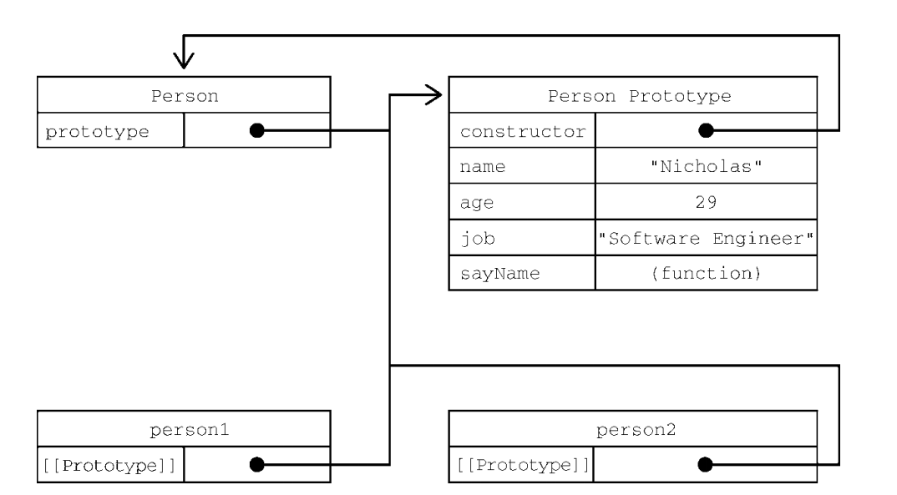

# Javascript

?> 基于**Javascript 高级教程第四版**的学习笔记

## 变量、作用域与内存

### 一、原始值与引用值

**原始值**就是最简单的数据，**引用值**是由多个值构成的对象

原始值包括：`Undefined` `Null` `Boolean` `Number` `String` `Symbol`

原始值是**按值访问**，操作的是存储在变量中的实际值  
引用值是**按引用访问**,无法直接操作

#### 1、动态属性

**引用值**可以随意添加、修改和删除其属性和方法，而**原始值**则不行（不会报错，但没意义）

```javascript
let person = new Object()
person.name = 'xxx' // OK
let num = 12
num.name = 'xxx' // undefined
```

#### 2、复制值

**原始值**被复制时会到新的变量位置，与原变量无关，**引用值**只是复制指向同一个对象的指针，会相互影响

```javascript
let num1 = 1
let num2 = num1 // num2与num1互补干扰

let obj1 = { name: 'xxx' }
let obj2 = obj1 // 两个变量指向同一个对象
obj2.name = 'yyy' // 此时obj1的name也变成yyy
```

#### 3、传递参数

?> 所有函数的参数都是按值传递的，意味着函数外的值会被复制到函数内部的参数中，就像从一个变量复制到另一个变量一样。

引用值传参的特殊情况

```javascript
function setName(obj) {
  obj.name = 'xxx'
  obj = new Object() // 此时在函数内部被重写，变成指向本地对象的指针
  obj.name = 'yyy'
}
```

#### 4、确定类型

在判断*原始类型*时可以使用`typeof`

```javascript
console.log(typeof 1) // number
console.log(typeof '1') // string
console.log(typeof undefined) // undefined
console.log(typeof true) // boolean
```

在判断*引用类型*时，使用`instanceof`

```javascript
console.log({ name: 'xxx' } instanceof Object)
console.log([1, 2] instanceof Array)
```

### 二、执行上下文与作用域

1. **上下文**决定了变量或函数可以访问哪些数据，以及它们的行为；
2. 所有通过`var`定义的全局变量和函数都会成为`window`对象的属性和方法，而使用`let`和`const`的顶级声明不会定义在全局上下文中；
3. 每个函数都有自己的**执行上下文**。当函数被调用时，函数的上下文被推到一个上下文栈，在执行完之后，再弹出该栈，ECMAScript 程序的执行流就是通过这个上下文进行控制的；
4. 上下文中的代码在执行的时候，会创建变量对象的一个**作用域链**

```javascript
let color = 'xxx'

function func1() {
  let color1 = 'xx'

  function func2() {
    let color2 = 'xx'
    // 这里可以访问color2、color1、color
  }
  // 这里可以访问color1、color
}
// 这里可以访问color

// 以上形成了各自的作用域链
```

#### 1、作用域链增强

有两种方式可以增强作用域链：

1. try/catch 语句的 catch
2. with 语句

#### 2、变量声明

`let`、`const`、`var（尽量不用）`

##### 1、var

1. 存在变量提升；
2. 在全局定义的变量会变成 window 的属性；

##### 2、let

块级作用域声明，作用域由最近的一堆`花括号{}`界定

与 `var` 的区别：

1. `let`不能重复声明，`var`重复声明会覆盖；
2. `var`有变量提升，`let`没有

##### 3、const

定义了就不能改，但如果是对象或数组，可以修改内部的值

```javascript
const a = { name: 'xxx' }
a.name = 123
a.age = 123
```

### 三、垃圾回收

> javascript 通过自动内存管理实现内存分配和闲置资源回收。  
> 基本思路是：确定那个变量不再使用，就释放它占用的内存。

#### 标记清理

当变量进入上下文时，这个变量就被加上存在于上下文的标记，当变量离开上下文时，也会被加上离开上下文的标记。然后垃圾回收程序在做一次内存清理。

#### 引用计数

对每一个值记录它被引用的次数，被引用加一，取消引用加一，当等于 0 时，就可以删除回收内存；会造成一个严重的问题：**循环引用**。

## 基本引用类型

?> 引用值（或者对象）是某个特定**引用类型**的实例；引用类型就是把数据和功能组织到一起的结构。

### 一、Date

基本语法：`let now = new Date()`

#### 常用方法：

1. 获取当前时间戳（毫秒数）`Date.now()`
2. 格式化时间 `new Date().toLocaleDateString()/toLocaleTimeString()`
3. 获取时间 `getFullYear()`,`getMonth()`,`getDate()`,`getDay()`,`getHours()`,`getMinutes()`,`getSecends()`

### 二、RegExp（正则表格式）

语法：`let expression = /pattern/flags`

**pattern**：模式，**flags**：标记

**标记：**

1. g：全局
2. i：不区分大小写
3. m：多行
4. y：粘附
5. u：Unicode 模式
6. s：dotAll 模式，表示元字符

简单使用示例：

```javascript
// 匹配所有at
let p = /at/g

// 匹配第一个"bat"或"cat"，忽略大小写
let p = /[bc]at/i

// 匹配所有以at结尾的组合，忽略大小写
let p = /.at/gi

// 匹配所有以.at结尾的组合，忽略大小写
let p = /\.at/gi
```

### 三、原始值包装类型

为了方便操作原始值，ECMAScript 提供了三个特殊的引用类型：`Boolean`、`Number`和`String`

实现的原理：

```javascript
let s1 = 'xxx' // 创建一个新的String实例
let s2 = s1.substring(2) // 调用实例的特定方法
// 销毁实例
```

#### Number

继承的方法：

1. `valueOf()` 返回原始数值  
   `(10).valueOf() // 10`
2. `toLocaleString()` 返回字符串
3. `toString()` 返回字符串（可指定基数）  
   `(10).toString(16) // 返回十六进制`

数值格式化：

1. toFixed(): 返回包含指定小数点位数的数值字符串（四舍五入）  
   `(1.222).toFixed(2) // 1.22`
2. toExponential(): 返回以科学计数法表示的数值字符串  
   `(10).toExponential(1) // '1.0e+1'`

安全整数（是否会溢出）: `Number.isInterger()`

#### String

#### 字符串操作方法

0. 获取字符位置 charAt()

```js
let str = 'abcd'

console.log(str.charAt(2)) // c
```

1. concat()：用于将一个或多个字符串拼接成一个新字符，一般使用`+`即可

```javascript
let str = '123'
str = str.concat('456') // 123456
str = str + '789' // 123456789
```

2. slice()、substr()、substring()：截取字符串

`slice()`和`substring()`第一个参数是开始截取的位置，第二个结束的位置（不包含）；`substr()`第一个参数是开始位置，第二个是要截取的个数；

例如：

```javascript
let str = 'hello world'

console.log(str.slice(3)) // lo world
console.log(str.substring(3)) // lo world
console.log(str.substr(3)) // lo world

console.log(str.slice(3, 7)) // lo w
console.log(str.substring(3, 7)) // lo w
console.log(str.substr(3, 7)) // lo worl
```

!>`ECMAScript`没有对`substr()`方法进行标准化，因为尽量不要使用

3. 字符串位置：indexOf()和 lastIndexOf()

在字符串中查找子字符串，如果没有找到，就返回-1，如果找到，就返回字符位置

4. 字符串包含方法：`includes()`、`startsWith()`、`endsWith()`

检查是否包括子字符串，返回`boolean`值

5. `trim()`: 去掉前后空格 `trimStart()`：只去前空格 `trimEnd()`: 只去后空格

```javascript
let str = ' hello world '

console.log(str.trim())
console.log(str.trimStart())
console.log(str.trimEnd())
```

6. replace(),replaceAll()：替代

```javascript
let str = 'hhhhh'

console.log(str.replace('h', 's')) // shhhh
console.log(str.replaceAll('h', 's')) // sssss
```

7. 解构

```javascript
let str = 'huang'

console.log([...str]) // [ 'h', 'u', 'a', 'n', 'g' ]
```

8. 大小写转换: `toUpperCase()`，`toLowerCase()`

```javascript
let str = 'huang'

console.log(str.toUpperCase()) // HUANG
console.log(str.toLowerCase()) //huang
```

### 四、单例内置对象

内置对象：由`ECMAScript`实现提供，并且在程序开始执行就存在的对象

#### Global

`Global`对象是一种兜底对象，也就是全局变量和方法挂载的对象（浏览器的为`window`对象），常用的方法：`isNaN()`、`isFinite()`、`parseInt()`、`parseFloat()`

1. URL 编码

`encodeURI()`和 `encodeURIComponent()`方法用于将 url 转换成浏览器可以理解的字符，主要区别是`encodeURI`不会编码属于 URL 组件的特殊字符，例如`://`，`encodeURIComponent`则会对这些字符进行处理

```javascript
let url = 'http://www.wrox.com/illegal value.js#start'

console.log(encodeURI(url)) // http://www.wrox.com/illegal%20value.js#start
console.log(encodeURIComponent(url)) // http%3A%2F%2Fwww.wrox.com%2Fillegal%20value.js%23start
```

?> encodeURIComponent()更彻底，所有一般使用这个

解码：`decodeURI` 对应 `encodeURI` ；`decodeURIComponent` 对应 `decodeURIComponent`

#### Math

保留数学公式、信息和计算的对象，提供一些辅助计算的属性和方法

1. `min()`和`max()`

```javascript
console.log(Math.min(1, 2, 3)) // 1
console.log(Math.max(1, 2, 3)) // 2
const arr = [1, 2, 3]
console.log(Math.max(...arr)) // 解构的使用方式
```

2. 数值取舍

`Math.ceil()` 向上取整  
`Math.floor()` 向下取整  
`Math.round()` 四舍五入  
`Math.fround()` 返回单精度（32）位显示

3. 随机数 `random`

返回 0-1 范围内的随机数，包含 0，不包含 1

```javascript
// 使用实例
console.log(Math.floor(Math.random() * 10 + 1)) // 1 - 10 的随机数
```

## 集合引用类型

- 对象
- 数组
- Map、WeakMap、Set 以及 WeakSet

### Object

创建 Object

```javascript
// 使用构造函数
let persion = new Object()
persion.name = 'xxx'

// 使用对象字面量(推荐使用)
let persion = { name: 'xxx' }
```

### Array

#### 创建数组

过去的创建方法都不太好，建议使用新增的`from()`和`of()`，`from()`将类数组结构转换为数组实例，`of()`将一组参数转换为数组实例

```javascript
// 所有可迭代的对象都可以使用from
console.log(Array.from('123')) // [ '1', '2', '3' ]
// 如果参数是数组，则原样返回，可用于浅拷贝数组
console.log(Array.from([1, 2, 3])) // [ 1, 2, 3 ]
// 使用第二个参数可以加工数据
console.log(Array.from('123', (x) => x * x)) // [ 1, 4, 9 ]

// 用于弥补new Array不好的创建方法
console.log(Array.of(1)) // [1]
```

#### 检测数组

`Array.isArray()`

```javascript
console.log(Array.isArray([])) // true
```

#### 迭代器

`keys()`返回数组索引  
`values()`返回数组元素
`entries()`返回索引/值对

#### 复制和填充

copyWithin() fill()

#### 操作数组方法

`push()`数组末端推入
`pop()`数组末端推出
`shift()`数组首部推出
`unshift()`数组首部推入

#### 排序方法

`reverse()`将数据反向排序  
`sort()`按字符串排序

```javascript
const arr = [1, 2, 10, 15, 3, 32]

console.log(arr.sort((a, b) => a - b))
```

#### 连接数组

`concat()`或`[...arr, ...arr2]`

#### 操作数据

`slice()`与字符串的很像，不改变数组

`splice()`会改变原来的数组

```javascript
const arr = [1, 2, 3]
// 替换
arr.splice(0, 1, 5) // [5, 2, 3]
console.log(arr)
// 删除
arr.splice(0, 1)
console.log(arr) // [2, 3]
// 插入
arr.splice(0, 0, 5) // [5, 2, 5]
console.log(arr)
```

#### 数组搜索

`indexOf()`找不到返回负 1，找到返回索引  
`lastIndexOf()`从末尾开始找  
`includes()` 返回 boolean

#### 数组断言

`find()`和`findIndex()`一个返回第一个元素（只会返回一个），一个返回元素的索引

```javascript
const arr = [1, 2, 3]

console.log(arr.find((item, index, arr) => item === 2)) // 2
```

#### 迭代方法

1. `every` 对数组的每一项都运行传入的函数，如果每一个函数都返回`true`，则这个方法返回`true`
2. `filter` 对数组的每一个项都运行传入的函数，返回函数返回`true`的项的数组
3. `forEach` 对数组每一项都运行传入的函数，没有返回值
4. `map` 对数组每一项都运行传入的函数，返回每次函数调用的结果的数组
5. `some` 对数组每一项都运行传入的函数，如果有一项返回`true`，则返回`true`

#### 归并方法

`reduce()`和`reduceRigth()`

```javascript
const arr = [1, 2, 3]

console.log(arr.reduce((p, c) => p + c)) // 6
```

### Map

键值对的数据结构

#### 定义

`const m = new Map([['key1', 'val1']])`

```javascript
const m = new Map([
  [1, 1],
  [2, 3],
  [4, 5],
])

console.log(m) // Map(3) { 1 => 1, 2 => 3, 4 => 5 }
```

#### 增删改查

?> 初始化后，只能通过方法增删改查

1. 增 set() `m.set('key','val1')`
2. 删 delete() `m.delete('key')` clear() 删除所有
3. 查 get() `m.get('key')`
4. 判断 has() `m.has()`

#### Map 可以用任何数据结构作为 key

```javascript
const m = new Map()
const funcKey = () => {}
m.set(funcKey, 'function')
console.log(m) // Map(1) { [Function: funcKey] => 'function' }
```

### Set

值的集合，不含重复的值

#### 初始化

`const m = new Set([v1, v2, v3])`

#### 基本操作

1. add() 新增
2. has() 查询
3. delete() 删除 clear() 清空

#### 常用方法：数组去重

```javascript
const arr = [1, 2, 2, 2]
console.log([...new Set(arr)]) // [ 1, 2 ]
const arr1 = [{ name: 1 }, { name: 1 }] // 对对象数组无效
console.log([...new Set(arr1)]) // [ { name: 1 }, { name: 1 } ]
```

## 迭代器与生产器

### 迭代

简单来说就是循环

```javascript
for (let i = 0; i < 10; i++) {
  console.log(i)
}
```

### 迭代器模式

就是统一所有可迭代的数据结构，通过实现 Iterable 接口，可以统一使用`for..of`进行迭代

#### 1. 可迭代协议

迭代器必须暴露一个属性，用`Symbol.iterator`作为键，这个默认迭代器属性必须引用一个迭代器工厂函数，调用这个工厂函数必须返回一个新的迭代器

检查时候存在默认迭代器属性的

```javascript
let arr = [],
  num = 1

console.log(arr[Symbol.iterator]) // [Function: values]
console.log(num[Symbol.iterator]) // undefined
```

#### 2. 迭代器协议

迭代器是一种一次性使用的对象，用于迭代与其关联的可迭代对象。迭代器 API 使用`next()`方法来遍历数据；每次成功调用`next()`，会返回一个`IteratorResult`对象，包含两个属性：`done`和`value`，`done：true`状态称为耗尽

```javascript
let arr = [1, 2, 3]

// 取出迭代器
const iterator = arr[Symbol.iterator]()

console.log(iterator.next()) // { value: 1, done: false }
console.log(iterator.next()) // { value: 2, done: false }
console.log(iterator.next()) // { value: 3, done: false }
console.log(iterator.next()) // { value: undefined, done: true }
// 迭代器是一次性的，后续继续调用，也会返回done：true
console.log(iterator.next()) // { value: undefined, done: true }
```

#### 3. 自定义迭代器

```javascript
class Counter {
  constructor(limit) {
    this.limit = limit
  }

  [Symbol.iterator]() {
    // 这样返回，可以每个迭代器都是独立的
    let count = 1,
      limit = this.limit
    return {
      next() {
        if (count <= limit) {
          return { value: count++, done: false }
        } else {
          return { value: undefined, done: true }
        }
      },
    }
  }
}
```

### 生成器

#### 生成器基础

生成器的形式是一个函数，函数名前面加一个星号`*`表示它是一个生成器

```javascript
// 生成器函数声明
function* genratorFn() {}
```

?> 箭头函数不能用来定义生成器

调用生成器函数会产生一个生成器对象，一开始处于暂停，内部实现了`Iterator`接口，调用`next()`方法可以让生成器开始或恢复

```javascript
// 定义一个生成器函数
function* genratorFunc() {}

let g = genratorFunc()

console.log(g) // Object [Generator] {}
console.log(g.next()) // { value: undefined, done: true }
```

#### 通过`yield`中断执行

`yield`可以让生成器停止和开始执行，生成器函数在遇到`yeild`会暂停函数，并将`yeild`后面的值输出

```javascript
function* genratorFunc() {
  yield 123
  yield 3434
  return 999
}

let g = genratorFunc()

console.log(g.next()) // { value: 123, done: false }
console.log(g.next()) // { value: 3434, done: false }
console.log(g.next()) // { value: 999, done: true }
```

1. 生成器对象作为可迭代对象

```javascript
function* generatorFunc() {
  yield 1
  yield 2
  yield 3
}

for (let i of generatorFunc()) {
  console.log(i)
}
// 1 2 3
```

2. 使用`yield`实现输入和输出

`yield`可以作为函数的中间参数使用。上一次让生成器函数暂停的`yield`关键字会接收到传给`next()`方法的第一个值，但第一次调用`next()`传入的值不会被使用

## 对象、类与面向对象编程

### 1、理解对象

对象是一组属性的无序集合。

#### 1.1、属性的类型

ECMAScript 使用一些内部特性来描述属性的特性；开发者不能在 Javascript 中直接访问这些特性；为了将某个特性标识为内部特性，规范会用两个中括号把特性的名称括起来

###### 数据属性

数据属性包含一个保存数据值的位置，大白话就是用来描述该属性的一些特性

1. `[[Configurable]]`:表示属性是否可以通过`delete`删除并重新定义，是否可以修改它的特性，以及是否可以把它改为访问器属性，默认情况下都为`true`
2. `[[Enumerable]]`:表示属性是否可以通过`for-in`循环返回，默认情况都是`true`
3. `[[Writable]]`:表示属性的值是否可修改，默认都是`true`
4. `[[Value]]`:包含属性实际的值，默认是`undefined`

要修改属性的默认特性，必须使用`Object.defineProperty()`，该方法接受三个参数：要操作的对象，属性的名称，描述符对象

```javascript
// 定义一个空对象
let person = {}

// 添加一个name属性的值，并修改默认特性不能修改该值
Object.defineProperty(person, 'name', {
  value: 'hhh',
  writable: false,
})

console.log(person.name) // hhh
person.name = '123'
console.log(person.name) // hhh
```

!> 正常情况下，很少使用`Object.defineProperty()`来修改这些特性

###### 访问属性

访问器属性不包含数据，它包含一个获取函数（`getter`）和设置函数（`setter`）；在读取访问器属性时，会调用获取函数，函数要返回一个有效的值；在写入访问器属性时，会调用设置函数并传入新值  
访问器属性也是必须通过`Object.definedProperty()`来使用

```javascript
// 定义一个对象，有一个私有属性
let obj = {
  status: '大于零',
  name: 'book1',
}

Object.defineProperty(obj, 'num', {
  get() {
    return this.status
  },
  set(value) {
    if (value > 10) {
      this.status = '大于零'
    } else {
      this.status = '小于零'
    }
  },
})

obj.num = 90
console.log(obj.num)
```

#### 1.2、读取属性的特性

使用`Object.getOwnPropertyDescriptor()`可以获取指定属性的属性描述符

```javascript
// 定义一个对象，有一个私有属性
let obj = {}

Object.defineProperty(obj, 'name', {
  value: 'huang',
  configurable: false,
})

console.log(Object.getOwnPropertyDescriptor(obj, 'name'))
// {
//   value: 'huang',
//   writable: false,
//   enumerable: false,
//   configurable: false
// }
```

#### 1.3、合并对象

`Object.assign()`:接受一个目标对象和一个或多个源对象作为参数 **属于浅拷贝**

```javascript
let obj1 = { name: 123 }
let obj2 = { name2: 123 }
let obj3 = Object.assign(obj1, obj2)
console.log(obj3) // {name: 123, name2: 123}
```

#### 1.4、相等判定

`Object.is()`

```javascript
console.log(Object.is(true, 1)) // false
console.log(Object.is({}, {})) // false
console.log(Object.is('2', 2)) // false
// 正确的 0、-0、+0 相等/不等判定
console.log(Object.is(+0, -0)) // false
console.log(Object.is(+0, 0)) // true
console.log(Object.is(-0, 0)) // false
// 正确的 NaN 相等判定
console.log(Object.is(NaN, NaN)) // true
```

#### 1.5、增强的对象语法

1. 属性值简写：当属性名和变量名一样时，可简写

```javascript
let name = 'xx'
let person = { name } // 等于 {name: name}
```

2. 可计算属性

```javascript
let nameKey = 'name'
let obj = {}
obj[namekey] = 'xxx'
```

3. 简写方法名

```javascript
let person = {
  say() {
    // do something
  },
}
```

#### 1.6、对象解构

```javascript
let obj = {
  myName: 'xxx',
  age: 12,
}
// 变量名不一样时
let { myName: newName, age: newAge } = obj
console.log(newAge, newName)
// 变量名一样时
let { myName, age } = obj
console.log(myName, age)
```

### 2、创建对象

#### 工厂模式

```javascript
function createPerson(name, age) {
  let o = new Object()
  o.name = name
  o.age = age
  o.sayName = function () {
    console.log('Hello,' + o.name)
  }
  return o
}

let p1 = createPerson('xxx', 12)
console.log(p1)
```

虽然可以多次调用函数创建对象，但无法知道创建的是什么对象

#### 构造函数

```javascript
function Person(name, age) {
  this.name = name
  this.age = age
  this.sayName = function ()
}

let p1 = new Person('name', 12)
console.log(p1) // Person { name: 'name', age: 12 }
```

**构造函数的特点：**

1. 没有显式创建对象
2. 属性和方法直接赋值给了`this`
3. 没有`return`
4. 函数名大写，是为了区分普通函数和构造函数

**使用`new`创建对象的过程：**

1. 在内存中创建一个新的对象
2. 这个新的对象内部的`[[Prototype]]`特性被赋值为构造函数的`prototype`属性
3. 构造函数内部的`this`被赋值为这个新对象（即 this 指向新对象）
4. 执行构造函数内部的代码（为新对象添加属性）
5. 如果构造函数返回非空对象，则返回该对象；否则返回刚创建的新对象

###### 理解构造函数

构造函数也是普通函数，与普通函数没有任何区别，之所以能创建对象，可以理解为是先创建一个新对象，然后将构造函数的`this`指向该对象

```javascript
function Person(name, age) {
  this.name = name
  this.age = age
  this.sayName = function () {
    console.log(name)
  }
}

// 使用new实例时，this会被绑定到新对象上
let person1 = new Person('xxx', 21)
person.sayName() // 'xxx'

// 没有使用new创建一个新的对象，构造函数的this就会绑定到window上
Person('window', 11)
window.sayName() // 'window'

// 在新对象中调用
let o = new Object()
Person.call(o, 'object', 21)
o.sayName() // 'object'
```

###### 构造函数的问题

构造函数内部定义的方法，都是新的函数实例

```javascript
function Person() {
  this.sayName = function () {
    console.log(123)
  }
}

let p1 = new Person()
let p2 = new Person()
console.log(p1.sayName === p2.sayName) // false
```

#### 原型模式

```javascript
function Person(name, age) {
  Person.prototype.name = name
  Person.prototype.age = age
  Person.prototype.sayName = function () {
    console.log('Hello,' + this.name)
  }
}

let p = new Person('hh', 12)
p.sayName()
```

###### 对于原型的理解

在构造函数定义时，构造函数就会有 `prototype` 属性，该属性也是一个对象，称为原型对象；原型对象有一个 `constructor` 属性，该属性指回构造函数

```javascript
function Person() {}
// 就有prototype属性
console.log(Person.prototype)
// prototype的constructor指回Person构造函数
console.log(Person.prototype.constructor == Person)
// 正常的原型链都会终止于Object的原型对象
// Object原型的原型是null
```

实例中的 prototype 指向构造函数的原型，所有将属性和方法定义在构造函数的原型上，就可以共享属性

`isPrototypeOf()`可以确定两个对象是否有原型指向关系

```javascript
function Person() {}

let person = new Person()

console.log(Person.prototype.isPrototypeOf(person1)) // true
```

`getPrototypeOf()`可以原型对象

```javascript
function Person() {}

let person = new Person()

console.log(Object.getPrototypeOf(person)) // Person.prototype
```

`Object.create()`可以创建一个新对象，并为其指定原型

```javascript
let biped = {
  numLegs: 2,
}

let person = Object.create(biped) // 指向原型是biped
person.name = 'xxx'

console.log(person.name)
console.log(person.numLegs)
// 判断person的原型是不是biped
console.log(Object.getPrototypeOf(person) === biped)
```



###### 原型层级

在通过对象访问属性时，首先会找对象实例本身，如果本身有，则返回，如果没有，则进入原型对象上找

```javascript
function Person() {
  Person.prototype.name = 'xxx'
}

let person1 = new Person()
let person2 = new Person()

person1.name = 'www'
console.log(person1.name) // 'www'，来自实例
console.log(person2.name) // xxx 来自原型

// 定义了实例的属性，会切断与原型的联系，只能通过delete重新连接上
person1.name = null
console.log(person1.name) // null

delete person1.name
console.log(person1.name) // xxx
```

###### 原型与 in

有两种方式使用`in`操作符：单独使用和在`for-in`中使用  
单独使用时，无论属性在原型上还是在实例上，都会返回`true`

```javascript
let obj1 = { name: 123 }
let obj2 = Object.create(obj1)
obj2.name2 = 111

console.log('name' in obj2) // true
console.log('name2' in obj2) // true
```

`hasOwnProperty()`只有在实例上有的属性才返回`true`

```javascript
function Person {
  Person.prototype.name = '123'
}

let person1 = new Person()
person1.name2 = 'xxx'

console.log(person1.hasOwnProperty('name')) // false
console.log(person1.hasOwnProperty('name2')) // true
```

###### 对象的迭代

`Object.keys()`和`Object.values()`

### 3、继承

`ECMAScript`的继承主要是通过原型链实现的

#### 3.1、原型链

一个原型对象指向另外一个类型的实例

```javascript
function SuperType() {
  this.prototype = true
}

SuperType.prototype.getType = function () {
  return this.prototype
}

function SubType() {
  this.subprototype = false
}

// 继承
SubType.prototype = new SuperType()

SubType.prototype.getSubType = function () {
  return this.subprototype
}

let ins = new SubType()
console.log(ins.getSubType())
console.log(ins.getType())
```

###### 默认原型

默认情况下，所有引用类型的继承自`Object`，所以任何函数的默认原型都是一个**Object 实例**，所以可以继承同`String()`,`toLocaleString()`等方法的原因

###### 原型与继承的关系

确定原型与实例的方法有两种：

1. `instanceof`

```javascript
let person = {}

console.log(person instanceof Object)
```

2. `isPrototypeOf()`只要原型链中包含这个原型，则返回`true`

```javascript
let person = {}

console.log(Object.prototype.isPrototypeOf(person)) // true
```

###### 关于方法

子类如果要添加父类没有的方法或者覆盖父类的方法，都必须在原型赋值后再添加到原型上

```javascript
function SuperType() {}

function SupType() {}

SupType.prototype = new SuperType()

// 这里才能添加新的方法
SupType.prototype.getName = function () {
  return '123321'
}
```

!> 通过对象字面量添加新的方法，会导致与原来的原型断绝关系

```javascript
Object1.prototype = new SuperType()

// 使用字面量定义，此时会与原本的原型断开
Object1.prototype = {
  xxx() {
    // do something
  },
}
```

###### 原型链的问题

在使用原型实现继承时，原型实际上会变成另一个类型的实例，这意味着原先的实例属性摇身一变成为了原型的属性。

```javascript
function Type1() {
  this.colors = [1, 2, 3]
  this.name = '12'
}

function Type2() {}

// 继承SuperType
Type2.prototype = new Type1()

let i = new Type2()
i.colors.push(4)
i.name = 'i'
console.log(i.colors) // 1,2,3,4
console.log(i.name) // i

let i2 = new Type2()
console.log(i2.colors) // 1,2,3,4
console.log(i2.name) // 12
```

分析上面的例子:  
首先构造函数`Type1`里面定义了`name`属性，在`Type2`继承时会变成`Type1`的一个实例，原理与使用构造函数定义对象一样，此时`Type2.prototype`也有了`name` 属性，最终所有的`Type2`的实例都会继承这个属性

#### 3.2 盗用构造函数

#### 3.3 组合继承

#### 3.4 原型式继承

#### 3.5 寄生式继承

#### 3.6 寄生式组合继承

### 4、类

#### 4.1、类的定义

类表面上看起来可以支持正式的面向对象编程，实际本质使用的仍然是原型和构造函数的概念

类的声明：`class Person {}`

###### 类的构成

类可以包含**构造函数方法**、**实例方法**、**获取函数**、**设置函数**和**静态类方法**

#### 4.2、类构造函数

`constructor`关键字用于在类定义块内内部创建类的构造函数。非必须

###### 实例化

使用`new`操作符实例化`Person`的操作等于使用`new`调用其构造函数

```javascript
class Animal {}

class Cat {
  constructor(name) {
    console.log('cat')
    this.name = name
  }
}

const animal = new Animal() // 此处如果没有构造函数，可以不加（）

const cat = new Cat('cat') // cat
```

默认情况先，类的构造函数会返回 this，如果没有返回 this，而是其他对象，那么这个新对象的 instanceof 操作符无法检测出与类有关联

```javascript
class Person {
  constructor(override) {
    if (override) {
      return {
        name: 'xxx',
      }
    }
  }
}

let p1 = new Person(),
  p2 = new Person(true)

console.log(p1 instanceof Person) // true
console.log(p2 instanceof Person) // false
```

类构造函数和构造函数的区别：调用类构造函数必须使用`new`，而普通构造函数如果不使用`new`，默认情况下会把属性加入全局变量中（`window`或`gloabl`）

###### 类本质就是一个函数

```javascript
class Person {}

// 类型为函数
console.log(typeof Person) // function
// 原型的构造函数还是只想本身
console.log(Person === Person.prototype.constructor) // true
```

#### 4.3、实例、原型和类成员

类可以定义存在于实例的成员、存在于原型上的成员、以及存在于类本身的成员

###### 实例成员

每次通过`new`调用类，都会执行类构造函数，在这个函数内部可以为新创建的实例添加“自有”属性；在构造函数执行完毕后，仍然可以给实例继续添加新成员。也就是说，使用`this`的属性就是实例成员

```javascript
class Person {
  constructor() {
    this.name = '123213'
    this.arr = [1, 2, 3]
  }
}

let p1 = new Person(),
  p2 = new Person()

console.log(p1.name === p2.name) // true
console.log(p1.arr === p2.arr) // false
console.log(p1 === p2) // false
```

###### 原型方法与访问器

在类块中定义的方法作为原型方法

```javascript
class Person {
  // 此方法为原型方法
  say() {
    console.log('xxx')
  }
}

Person.prototype.say() // xxx
```

!> 类中不能给原型添加原始值或者对象作为成员数据

```javascript
class Person {
  name: 'Jake'
}
// Uncaught SyntaxError: Unexpected token
```

类定义也支持获取和设置访问器，与普通对象一样

```javascript
class Person {
  constructor() {
    this.name_ = 'xxx'
  }
  set name(val) {
    this.name_ = val
  }
  get name() {
    return this.name_
  }
}

let p1 = new Person()
console.log(p1.name) // xxx
p1.name = 'p1'
console.log(p1.name) // p1
```

###### 静态方法

静态方法通过用于执行不需要实例的操作，也不要求存在类的实例

```javascript
class Person {
  static say() {
    console.log('person')
  }
}

Person.say()
```

#### 4.4 继承

`ES6`原生支持类继承机制，但本质还是使用原型链的原理

###### 继承基础

使用`extends`，既可以继承对象，不禁可以继承一个类， 还可以继承不同函数。

```javascript
class Animal {}

class Cat extends Animal {}

let cat = new Cat()
console.log(cat instanceof Cat) // true
console.log(cat instanceof Animal) // true
```

###### 构造函数、HomeObejct 和 Super()

派生类可以通过 `super` 关键字引用它们的原型，只能在类构造函数、实例方法和静态方法内部使用

1. 在子类构造函数里，第一步一定要调用`super`

```javascript
class Animal {
  constructor() {
    this.prototype = true
  }
}

class Cat extends Animal {
  constructor() {
    super()

    console.log(this instanceof Animal) // true
    console.log(this) // Cat { prototype: true }
  }
}

new Cat()
```

2. 静态方法中，可以通过 `super` 调用父类定义的静态方法

```javascript
class Animal {
  static say() {
    console.log(this)
  }
}

class Cat extends Animal {
  static sayMyself() {
    super.say()
  }
}

Cat.sayMyself() // [class Cat extends Animal]
```

3. 问题注意点

```javascript
// super只能在派生类构造函数和静态方法中使用
class Person {
  constructor() {
    super() // Error
  }
}

// 不能单独调用super，要么用来调用构造函数，要么用来引用静态方法
class Animal {}
class Cat extends Animal {
  constructor() {
    console.log(super) // Error
  }
}

// 在类的构造函数中，不能在调用super之前引用this
class Animal {}
class Cat extends Animal {
  constructor() {
    console.log(this) // Error
  }
}

// 如果一个派生类中显式定义了构造函数，则要么调用super（），要么返回一个对象
class A {}
class B extends A {
  constructor() {
    super() // 调用super
  }
}
class C extends A {
  constructor() {
    return {} // 返回对象
  }
}
```

###### 抽象基类

定义：只能其他类继承，但本身不会被实例化，可以使用`new.target`阻止实例化

```javascript
class Animal {
  constructor() {
    // 如果是使用new，直接报错
    if (new.target === Animal) {
      throw new Error('这是一个基类，不能用来实例化')
    }
  }
}
```

###### 继承内置类型

```javascript
class SuperArray extends Array {}
// 此时SueprArray就用了Array类的所有属性和方法
const arr = new SuperArray(1, 2, 3, 4) // [1,2,3,4]
```

###### 类混入 Object.assign()

```javascript
class A {
  constructor() {
    this.a = 'a'
  }
  A() {
    console.log('A')
  }
}

class B {
  constructor() {
    this.b = 'b'
  }
  B() {
    console.log('B')
  }
}

class C {
  constructor() {
    this.c = 'c'
  }
  C() {
    console.log('C')
  }
}

const d = Object.assign(new A(), new B(), new C())

console.log(d)
```

## 代理与反射

### 1、代理基础

代理是目标对象的抽象，它可以用作目标对象的替身，又完全独立于目标对象

###### 创建空代理

代理使用`Proxy`构造函数创建，主要接收两个参数：目标对象和处理程序对象（缺一不可）

```javascript
const target = {
  id: 'target',
}

const handle = {}

const proxy = new Proxy(target, handle)

// 拥有一样的属性
console.log(target.id)
console.log(proxy.id)

// 原对象添加属性，代理也会具备
target.name = 'xxx'
console.log(proxy.name)

// 代理添加属性，原对象也具备
proxy.name2 = 'eee'
console.log(target.name2)
```

###### 捕获器

在处理程序对象中定义的**基本操作的拦截器**

```javascript
const target = {
  id: 'target',
}

const handle = {
  get() {
    console.log('捕获')
  },
}

const proxy = new Proxy(target, handle)

console.log(target.id) // target
console.log(proxy.id) // 捕获，但没有实际返回 id 的值
```

###### 捕获器参数和反射 API

捕获器接收到的三个参数：目标对象、要查询的属性和代理对象

```javascript
const target = {
  a: 'a',
  b: 'b',
}

const proxy = new Proxy(target, {
  get(target, propKey, receiver) {
    if (propKey === 'b') {
      return 'xxx'
    } else {
      return Reflect.get(...arguments)
    }
  },
})

console.log(target.b) // b
console.log(proxy.a) // a
console.log(proxy.b) // xxx
```

Reflect：反射，处理程序对象中所有可以捕获的方法都有对象的反射 API 方法，这些方法与捕获器拦截的方法具有相同的名称和函数签名，而且具有与被拦截方法相同的行为  
简单来说就是方便处理捕获的数据

```javascript
const target = {
  id: 12,
}

const handle = {
  get(target, propKey, receiver) {
    return Reflect.get(...arguments)
  },
  // 简写版
  get: Reflect.get,
}

const proxy = new Proxy(target, handle)

console.log(proxy.id)
```

###### 可撤销代理

使用`revocable()`可以定义支持撤销代理对象与目标对象，撤销是不可逆的

```javascript
const target = {
  id: 123,
}

const handle = {
  get() {
    return 999
  },
}

// 定义可撤销代理
const { proxy, revoke } = Proxy.revocable(target, handle)

console.log(proxy.id)
console.log(target.id)

// 撤销代理
revoke()

console.log(proxy.id) // 会报错
```

###### 代理另一个代理

```javascript
const target = {
  id: 1,
}

const proxyFirst = new Proxy(target, {
  get() {
    console.log('第一次代理')
    return Reflect.get(...arguments)
  },
})

// 代理一个代理
const proxySecond = new Proxy(proxyFirst, {
  get() {
    console.log('第二次代理')
    return Reflect.get(...arguments)
  },
})

console.log(proxySecond.id)
// 第二次代理
// 第一次代理
// 1
```

### 2、代理与反射实例方法

###### get()

`get()`捕获器会在获取属性值的操作中被调用

拦截的操作:

1. proxy.property
2. proxy[property]
3. Object.create(proxy)[property]
4. Reflect.get(proxy, property, receiver)

```javascript
const target = {}

const proxy = new Proxy(target, {
  // 捕获，三个参数：目标对象，属性名，代理对象
  get(target, property, receiver) {
    // 反射
    return Reflect.get(...arguments)
  },
})
```

###### set()

`set()`捕获器会在设置属性值的操作中被调用

拦截的操作:

1. proxy.property = value
2. proxy[property] = value
3. Object.create(proxy)[property] = value
4. Reflect.set(proxy, property, value, receiver)

```javascript
const target = {}

const proxy = new Proxy(target, {
  // 参数：目标对象，属性名，值，代理对象
  set(target, property, value, recevier) {
    return Reflect.set(...arguments)
  },
})
```

###### has()

`has()`捕获器会在`in`操作符中被调用

拦截的操作

1. property in proxy
2. property in Object.create(proxy)
3. with(proxy) {(property);}
4. Reflect.has(proxy, property)

```javascript
const target = {}

const proxy = new Proxy(target, {
  has(target, property, receiver) {
    return Reflect.has(...arguments)
  },
})

console.log('foo' in proxy)
```

###### defindProperty()

`defindProperty()`捕获器会在`Object.defineProperty()`中调用

拦截的操作

1. Object.defineProperty()
2. Reflect.defineProperty()

```javascript
const target = {}

const proxy = new Proxy(target, {
  // 目标对象，属性名，含可选的 enumerable、configurable、writable、value、get 和 set 定义的对象
  defineProperty(target, property, descriptor) {
    console.log('defineProperty')
    return Reflect.defineProperty(...arguments)
  },
})

Object.defineProperty(proxy, 'num', {
  value: 123,
})
```

###### getOwnPropertyDescriptor()

`getOwnPropertyDescriptor()`捕获器会在`Object.getOwnPropertyDescriptor()`中被调用

拦截的操作

1. Object.getOwnPropertyDescriptor(proxy, property)
2. Reflect.getOwnPropertyDescriptor(proxy, property)

```javascript
const obj = { n: 1 }

const proxy = new Proxy(obj, {
  // 目标对象，属性名
  getOwnPropertyDescriptor(target, property) {
    console.log('getOwnPropertyDescriptor')
    return Reflect.getOwnPropertyDescriptor(...arguments)
  },
})

console.log(Object.getOwnPropertyDescriptor(proxy, 'n'))
```

###### delectProperty()

`deletctProperry()`捕获器会在`delete`操作符中调用

拦截的操作

1. delete proxy.property
2. delete proxy[property]
3. Reflect.deleteProperty(proxy, property)

```javascript
const obj = { n: 1 }

const proxy = new Proxy(obj, {
  // 目标对象，属性名
  deleteProperty(target, property) {
    console.log('deleteProperty')
    return Reflect.deleteProperty(...arguments)
  },
})

delete proxy.n
```

###### ownKeys()

`ownKeys()`捕获器会在`Object.keys()`及类似方法中被调用

拦截的操作：

1. Object.keys()
2. Reflect.ownKeys()

```javascript
const obj = { n: 1 }

const proxy = new Proxy(obj, {
  // 目标对象
  ownKeys(target) {
    console.log('ownKeys')
    return Reflect.ownKeys(...arguments)
  },
})

Object.keys(proxy)
```

###### getPrototypeOf()

`getPrototypeOf()`捕获器会在`Object.getPrototypeOf()`中被调用

## 函数

- 函数表达式、函数声明及箭头函数
- 默认参数及扩展操作符
- 使用函数实现递归
- 使用闭包实现私有变量

函数实际上是对象，也有属性和方法，函数名是指向函数对象的指针

```javascript
// 函数声明式
function func() {}
// 函数表达式
const func2 = function () {}
// 箭头函数
const func3 = function () {}
```

#### 箭头函数

不能使用`arguments`、`super`、`new.target`，也不能作为构造函数

### 函数名

函数名就是指向函数的指针

```javascript
function func() {
  console.log('13')
}

// 不使用括号，只是简单调用函数的指针
const func2 = func
// 使用括号，就是调用函数
func() // 13
```

### 函数参数

- 函数参数在内部是一个数组的形式接收，所以多传，少传都可以
- 使用`arguments`对象可以获取全部传入的参数

```javascript
function func(name) {
  console.log(name)
  console.log(...arguments)
}

func(1, 2, 2, 3, 3) // 1           1 2 2 3 3
```

- 可以使用`arguments[n]`获取第 n 个参数

### 没有重载

当函数名被重写，就等于覆盖

```javascript
function func() {
  console.log(1)
}
func = () => {
  console.log(2)
}
func() // 2
```

### 默认参数值

`function func(name = 'xx') {}`

### 参数扩展与收集

#### 扩展参数

```javascript
let arr = [1, 2]
function sum() {
  let sum = 0
  for (let i = 0; i < arguments.length; i++) {
    sum += arguments[i]
  }
  return sum
}

// 扩展参数
console.log(sum(...arr))
```

#### 收集参数

```javascript
function sum(...value) {
  // do something
}
```

### 函数声明与函数表达式

- 函数声明有函数声明提升，韩式表达没有

```javascript
sum()

function sum() {
  console.log('sum')
}

sum2()

const sum2 = () => {
  // 报错
  console.log('sum2')
}
```

### 函数作为值

因为函数名是指向函数的变量，所以函数也可以作为另一个函数的参数

```javascript
function sum(a) {
  return a + 10
}

function sum2(func, n) {
  return func(n)
}

console.log(sum2(sum, 3)) // 13
```

### 函数内部

函数内部存在三个特殊的对象：`arguments`、`this`、`new.target`

#### this

在标准函数中，this 引用调用方法的上下文对象；在箭头函数中，this 引用定义时的上下文对象

```javascript
// 要在浏览器环境下
color = 'color'

let o = {
  // color: 'hhh',
}

function func() {
  console.log(this.color)
}

func() // color 全局环境中调用
o.func = func
o.func() // hhh 在对象内调用，上下文是对象

let func2 = () => {
  console.log(this.color)
}

func2() // hhh
o.func2 = func2
o.func2() // hhh
```

#### new.target

检测函数是否用`new`调用

```javascript
function func() {
  if (new.target) {
    console.log('使用new调用')
  } else {
    console.log('没有使用new调用')
  }
}

new func() // 使用new调用
func() // 没有使用new调用
```

### 函数的属性和方法

- 因为函数也是对象，所有也有属性和方法
- 每个函数都有两个属性：`length`和`prototype`
- 函数有三个方法：`apply`、`call`、`bind`，都是用来指定`this`的

### 递归

函数通过函数名调用自己

```javascript
function fac(n) {
  if (n == 1) {
    return 1
  }
  return n * fac(n - 1)
}

console.log(fac(10))

// 优化
function fac2(n) {
  if (n == 1) {
    return 1
  }
  return n * arguments.callee(n - 1)
}
```

### 闭包

闭包指那些引用了另一个**函数作用域中变量**的函数

###### this 对象
